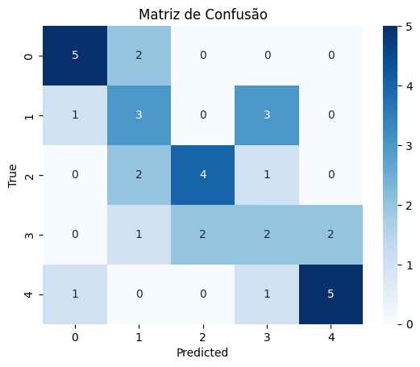

# Heart Disease Dataset

---
Fontes:
- [https://archive.ics.uci.edu/dataset/45/heart+disease](https://archive.ics.uci.edu/dataset/45/heart+disease)
- [Shap](https://shap.readthedocs.io/en/latest/index.html)

---
Descrição:  
- Fazer uma análise de dados do dataset Heart Disease e também desenvolver um script para aprender a utilizar a biblioteca [Shap](https://shap.readthedocs.io/en/latest/index.html)  

- Antes de usar as funções de Shap, vamos trabalhar no modelo de forma que possa ter a melhor performance no dataset.

- Percebe-se, em análises preliminares, que o dataset é muito desbalanceado. Além disso, possui muitos dados faltantes, criando um desafio extra de escolher retirar ou inputar informações.

- Basicamente possui 5 categorias de classificação que são numéricas, e vão de 0 a 4, que provavelmente indicam a chance do indivíduo ter um ataque cardíaco. 0 para não tem chance e 4 muita chances. 

- Abaixo um gráfico de como o dataset está desbalanceado:  

- E os modelos estavam performando muito mal. Um exemplo da matriz de confusão de um modelo: 

- Perceba que a classe 4 (maior chance de ataque cardíaco) não existe nenhuma predição, ou seja, os modelos não conseguem "aprender" sobre essa classe pois o dataset está muito desbalanceado. 

- Agora numa tentativa de "balancear" o dataset, retirando as instâncias que possuem classe majoritária e igualando as frequências de todas as classes, a performance melhora um pouco mais. 

- Veja o balanceamento das classes:  

- E o resultado de uma simples simulação baseado nesse novo dataset com todas as classes com a mesma frequência.  

- Muito melhor!!! A matriz de confusão começa a ter uma "cara" mais diagonal, ou seja, tentando predizer exatamente o que é real. Neste exemplo, o modelo previu 5 ataques cardíacos dentro de um universo de 7. Ou seja, uma precisão muito melhor que o modelo treinado num dataset desbalanceado. 